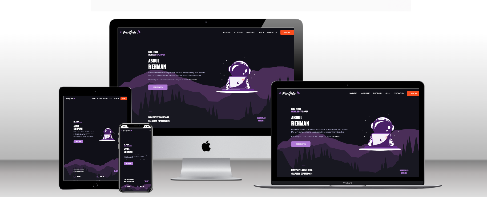

# Abdul-Rehman's Portfolio 🚀  |  Flutter 🔥 

Welcome to my Flutter-based portfolio! I'm Abdul Rehman, an avid developer passionate about creating innovative solutions with technology. Here, I showcase my journey with Flutter, a powerful framework for building beautiful and responsive applications. Through this project, I not only demonstrate my technical skills but also share insights into my development philosophy and aspirations.

## About Me
I'm a dynamic individual with a strong foundation in software development, particularly in Android and Flutter. With years of experience under my belt, I've honed my skills in crafting robust and user-centric applications. My love for technology extends beyond mere coding—I thrive on challenges, constantly seeking new opportunities to learn and grow.

## Why Flutter?

Flutter has been a game-changer for me. Its hot reload feature allows for rapid development, enabling me to see changes instantly as I code. Moreover, its expressive UI components and rich set of widgets make crafting stunning user interfaces a breeze. With Flutter, I've learned to create responsive and visually appealing applications for various platforms, including web, mobile, and desktop.

  

## Why GitHub?

GitHub is not just a platform for hosting code—it's a community, a collaboration hub, and a catalyst for innovation. Here are a few reasons why GitHub plays a crucial role in my development journey:

1. **Version Control**: GitHub's robust version control system allows me to track changes, collaborate with teammates, and revert to previous states with ease. This ensures the integrity and stability of my projects, even in the face of complex development workflows.

2. **Collaboration**: GitHub fosters a culture of collaboration, enabling developers from around the world to work together on projects of all sizes. Through pull requests, code reviews, and discussions, I've had the opportunity to learn from others, share my expertise, and contribute to open-source initiatives.

3. **Community**: GitHub's vibrant community is a constant source of inspiration and support. From discovering new projects to seeking help with technical challenges, I've found the GitHub community to be welcoming, inclusive, and ever-ready to lend a helping hand.

4. **Continuous Integration and Deployment (CI/CD)**: GitHub Actions, GitHub's built-in CI/CD platform, empowers me to automate workflows, test code changes, and deploy applications—all within the familiar GitHub environment. This seamless integration streamlines my development process, allowing me to focus on building innovative solutions.

## CI/CD Pipeline

One of the highlights of this project is the implementation of a robust CI/CD pipeline. Leveraging GitHub Actions, I've automated the deployment process, ensuring that any changes I make to my private repository are seamlessly propagated to this public repository. This streamlined workflow not only enhances productivity but also maintains the privacy of my code while allowing for continuous deployment.

## Why the Dual Repository Setup?

You might wonder why I maintain two repositories—one private and one public. Well, GitHub Pages, where I host this portfolio, requires the repository to be public for deployment. However, to safeguard the integrity of my code, I keep the primary development repository private. This setup ensures that my code remains secure while enabling automated deployment to the public repository, providing a hassle-free experience for both development and deployment.

## Conclusion

Flutter has empowered me to create stunning applications with ease, while CI/CD pipelines have revolutionized my development workflow. By maintaining a dual repository setup, I strike a balance between code privacy and seamless deployment. As I continue to explore the vast capabilities of Flutter, I look forward to pushing the boundaries of creativity and innovation in my projects.

## Languages and Tools

## Thank you for visiting my portfolio! 🎉
